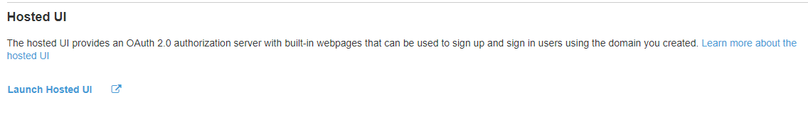

# AWS GameLift with Unreal Engine

## Credits to Flopperam:

[Link to Flopperam's Tutorial Playlist](https://www.youtube.com/watch?v=tOy0xYaP3wA&list=PLa1dM5bPQv0u2IWZRIxtRqwWVJNOUtlbF)

This tutorial is more linear, meaning you are creating the entire project from scratch. Rather than continuing from the finished build in this repo.

## Installation:

- [How to install Unreal Engine Source](https://docs.unrealengine.com/4.27/en-US/ProgrammingAndScripting/ProgrammingWithCPP/DownloadingSourceCode/)
    - **Troubleshooting:**
    - Associate your GitHub account to your Unreal Account (IMPORTANT)
    - Be sure to use the correct version of Visual Studios
- [How to install AWS CLI](https://aws.amazon.com/cli/)
    - [Find your access keys](https://docs.aws.amazon.com/general/latest/gr/aws-sec-cred-types.html). Open command prompt and use:
    ```
    aws configure
    ```
    - Type in your access keys, choose Default region name: $(REGION_NAME), and Default output format: json 
    - [How to find available GameLift regions](https://aws.amazon.com/gamelift/faq/). I will be using, **us-west-2**, which is based in Oregon.

## Start Up:
*Guide to begin accessing the Test Project:*

- Right click the GameLiftTutorial.uproject and generate the Visual Studios project.
- Select Development Editor, Win64 and build the project.
- This time select Development Server, Win64 and build again.
- Launch the GameLiftTutorial.uproject (or rebuild the development editor)
- On the top left, File -> Package Project -> Build Target -> GameLiftTutorial
- Then package the project, File -> Package Project -> Win64 (can choose any build, just specify when uploading to AWS)

## Uploading to AWS:
*Packaging the game files to AWS and allowing AWS to launch a light-weight EC2 desktop with the server executable*

- [Download VC_Redist x64](https://support.microsoft.com/en-us/topic/the-latest-supported-visual-c-downloads-2647da03-1eea-4433-9aff-95f26a218cc0)
    - This allows the EC2 instance to run Visual Studio Code!
    
- Navigate to WindowsServer inside the game folder, drag and drop the installation executable into the folder.
- Create a install.bat file inside the folder and add these commands
    ```
    VC_redist.x64.exe /q
    Engine\Extras\Redist\en-us\UE4PrereqSetup_x64.exe /q
    ```
- Open a terminal and use this command. 
    ```
    aws gamelift upload-build --name GameLiftTutorial --build-version 1.0.0 --build-root $(FILE_PATH_TO_SERVER_FILES) --operating-system WINDOWS_2012 --region $(REGION_NAME)
    ```

    - Operating system is based on the build of the packaged Unreal Engine game, ex. Windows above.
    - $(REGION_NAME) - I have been using **us-west-2**

## Creating the Fleet, Queue and Matchmaking:

- Navigate to the AWS GameLift dashboard

- You will see that your packaged server is on AWS, but now we need to create the **Fleet:**
    - **Name:** $(NAME)
    - **Fleet Type:** Choose $(ON-DEMAND) for reserved resources for your server, or $(SPOT) for leftover resources (This is Cheaper!)
    - **Build:** $(GameLiftTutorial 1.00 ...)
    - **Home Region:** Ensure that this region is the same as what you used to upload earlier
    - *Leave everything else as default*
    - **Launch Path:** \game\GameLiftTutorial\Binaries\Win64\GameLiftTutorialServer.exe
        - Parameters: -port=7777
        - Concurrent Processes: 1
        - Don't forget the green check mark!
    - **EC2 Port Range:** 7777
        - Protocol: UDP
        - IP Address: 0.0.0.0/0
    - Click Submit! This will take a couple of minutes to create.
- Creating the **Queue:**
    - Choose any name
    - Down at the bottom, click add destination
    - Select the region, Fleet, and the name of the Fleet we just created.
- Creating the **Matchmaking:**
    - Navigate to "Create matchmaking rule set"
    - [Use the first example for rule set](https://docs.aws.amazon.com/gamelift/latest/flexmatchguide/match-examples.html)
    - Click Validate, then Create.
    - Navigate to "Create matchmaking configuration"
        - Choose any name, leave everything as default
        - Request timeout: (Any number of seconds preffered, I had 60)
        - Rule set name: (Select the rule set created above).
    - Click Create!

## Creating Lambda Functions:
*Here we will create 11 different functions that we will connect together into a new API.*

- **InvalidateTokens** (GET)* -L
- **GetSignInResult** (GET)
- **RetrieveNewTokens** (POST)* -L
- **ValidateDuplicateEmail** -L
- **StartMatchmaking** (POST)* -L
- **PollMatchmaking** (POST)* -L
- **TrackEvents** -L
- **StopMatchmaking** (POST)* -L 
- **InitializePlayerData** -L
- **ExchangeCodeForTokens** (POST)
- **GetPlayerData** (POST)* -L

**All of the code for these functions will be in the "lambda" folder of this repo**

Note: '-L' represents the need to create a layer before creating the function. 

In these functions, you will find sections where you will need to input the identification from the next sections.

## Setting up your Cognito User Pool:
*This is how we track users and enable the Google Sign In*

- Navigate: Manage User Pools -> Create User Pool -> $(NAME) -> Review Defaults -> Create Pool
- Add an App Client 
    - MAKE SURE TO UNCHECK "GENERATE CLIENT SECRET" <- If left checked, your lamdba functions will return "invalid client"
- On the side bar, click on App Client 
    - This is your **Client Id** that you will replace in your lambda code

## Let's skip over to API Gateways:
*This is creating our API call! We will need the lambda functions to complete our Cognito User Pool.

Note: We are only connecting 8/11 functions created above in our API.

- Create API -> Rest API -> Default settings
- Actions -> Create Resource -> $(NAME_OF_LAMBDA_FUNCTION) -> Create Resource
- Click on the resource created -> Actions -> Create Method -> $(GET/POST) -> Check "Use Lambda Proxy integration" -> $(REGION) -> $(NAME_OF_LAMBDA_FUNCTION)
    - In the section, Creating Lambda Functions, you will find which functions will need $(GET/POST)
- Complete the next 7 functions following the same steps!

- Action -> Deploy API 
- Navigate to Stages on the left sidebar 

## Back to Cognito User Pool:

- Click on the "get" of the "GetSignInResult" and copy the "InvokeURL"
    - For example, mine is: https://6oit029inf.execute-api.us-west-2.amazonaws.com/test/getsigninresult
- Navigating back to Cognito User Pool -> App Client Settings
- Check Select All -> Paste the InvokeURL into the CallbackURLs
- Check Authorization Code Grant -> Check all available scopes -> Save
- Navigate to "Domain Name" -> Create a Domain
- Back to App Client Settings
    - There should now be a Hosted UI that is availabe to click
    - 
- Navigate to Resource Servers 
    - Create a new resource, whatever you named as the identifier is what you'll see on your App Client Settings
    - Add a scope! I named mine "access" and "gdsfwe"
- Check the resource created above inside the App Client Setting

## Enabling Google Sign-on:

- [How to set up](https://developers.google.com/identity/sign-in/web/sign-in)
    - Calling from "Web Browser/Application"
    - Authorized Javascript Origin: $(https://arnoctest.auth.us-west-2.amazoncognito.com)
        - This is found through the Domain Name section inside Cognito
    - Authorized redirect URL: $(https://arnoctest.auth.us-west-2.amazoncognito.com/oauth2/idpresponse)
        - We just added oauth2/idpresponse at the end of the Domain Name!
    - **IMPORTANT: DON'T LOSE THESE CLIENT ID/SECRET**
    - Navigate to Cognito User Pool -> Identity Providers -> Select Google -> Paste your Client ID and Secret ID
        - Scope: profile email openid
    - Navigate to Attribute Mapping
        - Select Google
        - Check Email, in the drop down, Select Email and Save

Note: You can check if this works by clicking on Hosted UI from App Client Setting. You should see an option for Google Sign In!

## Finishing up Cognito User Pool:

- Navigate to Triggers 
    - Pre Sign Up -> Select ValidateDuplicateEmail
    - Post Sign Up -> Select InitializePlayerData
- Navigate back to API Gateways
- Create an Authorizer
    - Select Cognito
    - $(NAME_OF_USER_POOL)
    - Token Source: 'Authorization'
- ON ALL OF THE FUNCTIONS WITH A '*', you will need to complete the following
    - Select GET/POST -> Method Request
        - Authorization: $(NAME_OF_AUTHORIZER) 
        - OAuth Scope: $(NAME_OF_API_FROM_COGNITO)
            - Ex. arnoc.api/access

## Setting Up Additional Tables:
*Setting up DynamoDB and Amazon SNS*

- Create 2 tables, "MatchmakingTickets" and "Players" with the Partition Key: Id (String)
    - For MatchmakingTickets, enable TTL
    - Note: Use these exact name, unless you want to change all instances in the Lambda Functions

- Set up defaults of Simple Notification Service (SNS)

## Done!

- Be sure to go back into your lamdba functions and 'edit' the necessary functions!
- (Optional): Setting up CloudWatch for extra logs!
- (Postman): A quick way to test your lambda functions/API calls
- Note: You'll need to launch 2 instances at once for the matchmaking to work!

## Roadmap of the connection:


